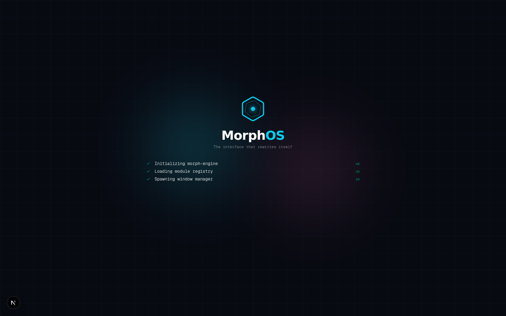

<div align="center">



# MorphOS

### The Interface That Rewrites Itself

A modular, self-evolving operating system built with Next.js 16, where AI generates UI modules on the fly. Talk to it in natural language — it spawns the right tool, writes the code, and mounts it in real-time.

[](https://nextjs.org)
[](https://www.typescriptlang.org)
[](https://tailwindcss.com)
[](LICENSE)

</div>

---

## ✨ Features

### 🧬 AI Module Forge
Describe what you need in plain language. MorphOS decides which module to spawn — or **generates a custom React component from scratch** using Babel, compiled and executed in a sandboxed environment at runtime.

### 📦 28 Built-in Modules
| | | | |
|---|---|---|---|
| 💬 Chat | 📊 Monitor | 📈 Dashboard | 🖥️ Terminal |
| 📋 Kanban | 📝 Notes | 💻 Code | 🌤️ Weather |
| 🕐 Clock | 🎵 Music | 🧮 Calculator | 📈 Stock |
| 📷 Camera | 📡 Metrics | ⏲️ Pomodoro | 🎨 Paint |
| 🔍 Regex | {} JSON | 🎨 Color Picker | 📱 QR Code |
| 🔧 Dev Tools | 📁 Files | 🌐 Browser | 📅 Calendar |
| ✏️ Whiteboard | 🖼️ Image Gen | ✨ Custom AI | 🧩 Plugins |

### 🤖 14 LLM Providers
Z.ai (GLM), OpenAI, Anthropic, Mistral, NVIDIA NIM, LM Studio, Ollama, Groq, OpenRouter, Together AI, Cohere, DeepSeek, xAI (Grok), and custom endpoints — all with streaming SSE support.

### 🖥️ Real Window Manager
- Drag, resize (8 handles), minimize, maximize, restore
- Window snapping (left/right/top/bottom + 4 corners)
- Z-order management with focus tracking
- Right-click context menus (adaptive per target)
- Keyboard shortcuts (⌘K palette, ⌘⇧S workspaces, ⌘, settings, ⌘⇧L language)

### 💾 Persistent Everything
- **Windows & layouts** — survive page reloads (localStorage)
- **Chat history** — full conversation persistence
- **Module states** — notes, kanban, terminal history all saved
- **Virtual File System** — real IndexedDB-backed VFS with CRUD
- **AI Memory** — persistent user preferences and context across sessions
- **Workspaces** — save and load named window layouts

### 🌍 Real Data (No Mocks)
- **Weather**: Open-Meteo API (real temperatures, wind, humidity for 6 cities)
- **Stock**: CoinGecko API (live crypto prices: BTC, ETH, SOL, ADA, LINK, DOT)
- **Monitor**: Performance API (real JS heap, FPS, network bandwidth, CPU estimation)
- **Metrics**: Real browser performance metrics with live event stream
- **Music**: Real audio playback (HTML5 Audio with SoundHelix royalty-free tracks)
- **Dashboard**: Deterministic data based on current week, KPIs calculated from real values

### 🎤 Voice Input
Speak to MorphOS instead of typing. Uses the Web Speech API (Chrome/Edge/Safari). The mic button appears only when supported.

### 🎨 Image Generation
Generate images using Z.ai SDK or DALL-E 3. Multiple sizes, prompt suggestions, history, and PNG download.

### 🌊 Streaming AI
LLM responses stream in real-time via Server-Sent Events. Watch the AI think as it generates.

### 🌐 Bilingual (EN/FR)
Full i18n with 130+ translation keys. Toggle between English and French instantly. The LLM responds in the selected language.

### 🎭 5 Dynamic Themes
Cyan, Emerald, Pink, Amber, Violet — the entire UI adapts via CSS variables.

---

## 🚀 Quick Start

```bash
# Install dependencies
bun install

# Start the dev server
bun run dev

# Or build for production
bun run build
bun run start
```

Open [http://localhost:3000](http://localhost:3000) and start talking to MorphOS.

### Default Provider
MorphOS uses **Z.ai (GLM-4.6)** out of the box — no API key needed. To use other providers, open Settings (gear icon, top-right) and configure your API key.

---

## 🎯 How to Use

1. **Talk to MorphOS** — hover your mouse at the bottom of the screen to reveal the command bar
2. **Type or speak** — "become a system monitor", "add a dashboard", "create a dice roller game"
3. **Watch it spawn** — the AI writes code and mounts the module in real-time
4. **Manage windows** — drag, resize, snap, minimize, maximize
5. **Right-click** anywhere for context menus
6. **⌘K** for the command palette
7. **⌘⇧S** to save/load workspaces
8. **Settings** to configure providers, language, theme, and more

---

## 🏗️ Architecture

```
src/
├── app/
│   ├── api/
│   │   ├── interpret/          — LLM module selection (multi-provider)
│   │   ├── interpret-stream/   — Streaming SSE version
│   │   ├── generate-module/    — AI code generation (Babel sandbox)
│   │   ├── generate-image/     — Image generation (Z.ai/DALL-E)
│   │   └── test-provider/      — Provider connection testing
│   ├── page.tsx                — Entry point
│   ├── layout.tsx              — ThemeProvider wrapper
│   └── globals.css             — Dark theme + animations
├── lib/
│   ├── providers.ts            — 14 LLM provider configs
│   ├── i18n.ts                 — EN/FR translations (130+ keys)
│   ├── settings-store.ts       — Zustand + localStorage persist
│   ├── window-store.ts         — Window manager (persisted)
│   ├── module-state-store.ts   — Module state persistence
│   ├── ai-context-store.ts     — AI memory (persisted)
│   ├── vfs-store.ts            — Virtual File System (IndexedDB)
│   ├── fallback-interpret.ts   — Offline keyword fallback (shared by interpret routes)
│   ├── plugins/                — Plugin registry + built-in plugins
│   ├── use-t.ts                — Translation hook
│   ├── use-voice-input.ts      — Web Speech API hook
│   └── utils.ts                — Utilities
├── components/
│   └── morph/
│       ├── morph-canvas.tsx         — Main canvas orchestrator
│       ├── morph-window.tsx         — Window wrapper (drag/resize/snap)
│       ├── top-bar.tsx              — Top bar (modules, settings, lang)
│       ├── command-dock.tsx         — Hover-to-reveal AI command bar
│       ├── command-palette.tsx      — ⌘K universal palette
│       ├── context-menu.tsx         — Right-click adaptive menu
│       ├── workspace-manager.tsx    — Save/load layouts
│       ├── settings-panel.tsx       — 3-tab settings modal
│       ├── boot-sequence.tsx        — Animated boot intro
│       ├── spawn-overlay.tsx        — AI code-writing animation
│       ├── keyboard-shortcuts.ts    — Global shortcuts
│       ├── theme-provider.tsx       — CSS variable injector
│       ├── module-registry.tsx      — 28 module registry (lazy-loaded)
│       └── modules/
│           ├── index.ts             — Barrel file
│           ├── chat-module.tsx      — Conversational console
│           ├── monitor-module.tsx   — Real Performance API
│           ├── dashboard-module.tsx — Analytics with Recharts
│           ├── weather-module.tsx   — Open-Meteo API
│           ├── stock-module.tsx     — CoinGecko API
│           ├── music-module.tsx     — HTML5 Audio player
│           ├── files-module.tsx     — VFS explorer (IndexedDB)
│           ├── custom-module.tsx    — AI code sandbox (Babel)
│           ├── imagegen-module.tsx  — AI image generation
│           ├── extra-modules.tsx    — 11 modules in one file
│           └── ...                  — Other modules
```

---

## ⌨️ Keyboard Shortcuts

| Shortcut | Action |
|----------|--------|
| `⌘K` / `Ctrl+K` | Open command palette |
| `⌘⇧S` / `Ctrl+Shift+S` | Open workspace manager |
| `⌘,` / `Ctrl+,` | Open settings |
| `⌘⇧L` / `Ctrl+Shift+L` | Toggle language (EN/FR) |
| `⌘W` / `Ctrl+W` | Close active window |
| `⌘M` / `Ctrl+M` | Minimize active window |
| `⌘⏎` / `Ctrl+Enter` | Toggle maximize |
| `⌘←/→/↑/↓` | Snap window (hold ⇧ for corners) |
| `⌘⇧W` / `Ctrl+Shift+W` | Close all windows |
| `⌘Tab` / `Ctrl+Tab` | Cycle through windows |
| `Right-click` | Context menu (adaptive) |

---

## 🔒 Privacy

- API keys are stored in **your browser's localStorage** — never sent to our servers
- The `/api/*` routes act as proxies, forwarding requests directly to the chosen provider
- No telemetry, no tracking, no analytics
- Factory Reset clears everything **except** your API keys

---

## 🛠️ Tech Stack

| Technology | Purpose |
|-----------|---------|
| Next.js 16 (Turbopack) | Framework + API routes |
| TypeScript 5 | Type safety |
| Tailwind CSS 4 | Styling |
| Framer Motion | Animations |
| Zustand | State management (persisted) |
| Recharts | Dashboard charts |
| @babel/standalone (CDN) | Runtime TSX compilation for AI modules |
| IndexedDB | Virtual File System |
| Web Speech API | Voice input |
| SSE (Server-Sent Events) | Streaming AI responses |

---

## 📄 License

MIT License — feel free to use, modify, and distribute.

---

<div align="center">

**Built with ⚡ by the MorphOS project**

*The interface is the message.*

</div>
